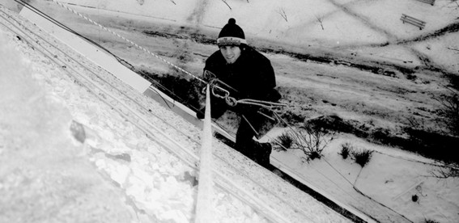

Зимние пейзажи необычайно красивы — заснеженные деревья и улицы, живописные сосульки, узоры на стеклах. Но эта красота часто имеет печальные последствия во время оттепелей. Сосульки, намерзшие на крышах зданий, при падении представляют угрозу для жизни пешеходов. А снег, накопившийся за зиму, при таянии может привести к протеканию крыш.

Компания «Снежный барс» поможет вам наслаждаться зимней красотой и избежать неприятных последствий таяния снега. Услуги компании включают [снятие сосулек](/uborka-snega-s-krysh/ "Удаление сосулек") и уборку крыш.

Альпинисты-высотники удаляют сосульки в самых разнообразных и недоступных для другой техники местах. Чтобы не перекрывать движение по тротуару, работники «Снежного барса» могут проводить работы ночью. Такая услуга особенно актуальна для торговых центров. Торговые компании смогут проявить заботу о безопасности покупателей, не причиняя им беспокойства.

Также в любое время суток [промышленные альпинисты](/ "Промальп") очистят вашу крышу от снега, предохраняя ее от протеканий. В результате вы сможете сэкономить на дорогостоящем ремонте перекрытий, сохраните чистый и красивый вид внутренних помещений, не дадите возможности развития плесени и грибка на отсыревших стенах.
