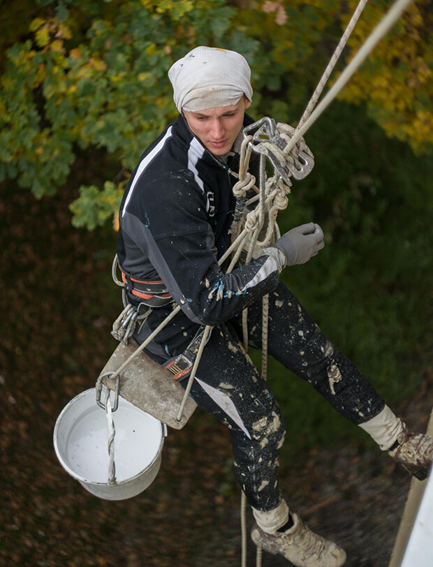
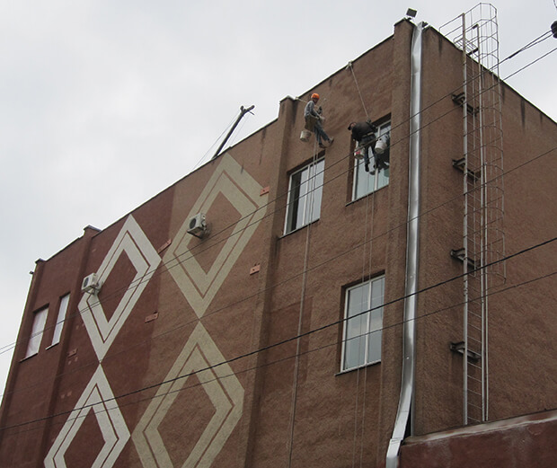
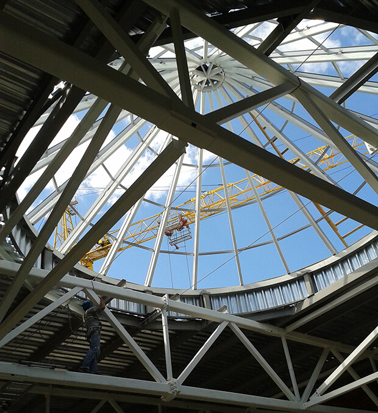

Любой фасад, без постоянного ухода, со временем становится непривлекательным. Промышленная и обычная пыль, неблагоприятные погодные условия и другие факторы оказывают негативное влияние на покрытие зданий. [Покраска фасада](/pokraska-fasadov-i-zhelezobetonnyx-konstrukcij/) может отлично решить эту проблему. К тому же, благодаря разнообразию цветов краски, вы можете легко освежить внешний вид любого здания. Будь то частный дом или многоквартирный жилой комплекс.

## Почему стоит воспользоваться нашими услугами?

[Промышленный альпинизм](/) чаще всего используется, когда доступ к определенным конструкциям и элементам зданий ограничен. А применение стандартных методов работы проблематично. Наши высококвалифицированные промышленные альпинисты легко выполнят покраску любых фасадов.

Потребность в промышленном альпинизме растет с каждым годом. Наши мастера используют только лучшее оборудование для обеспечения безопасности на сегодняшний день. В том числе и специальное альпинистское снаряжение. Дополнительно, это дает возможность избежать высоких затрат и потерь времени на обустройство люлек или лесов. В своей работы мы применяем обширные знания и большой опыт специалистов компании.  

Наши специалисты учитывают индивидуальные особенности каждого объекта. Кроме того, мы изучаем наиболее подходящие отделочные материалы и покрытия.  Анализируем степень загрязнения и местоположение. И, только тогда, предлагаем лучшее из доступных решений.

Мы качественно и быстро выполним фасадные работы:

* для частного дома;
* [промышленного здания](/elevatory-promyshlennye-cexa/) (например, это может быть покраска наружных стен производственного цеха);
* многоквартирного жилого дома;
* любых [коммерческих зданий](/obshhestvennye-obekty-trc-vokzaly/): например, бизнес-центров, гостиниц или магазинов.

## Этапы подготовки и окраски фасадов

* Очистка. Перед покраской совершенно необходимо провести качественную очистку. Поверхность нужно обеспылить  и обезжирить. Если присутствует старая краска — её необходимо снять. В особо запущенных случаях, используется гидроструйная очистка фасада.
* Восстановление. Перед следующим этапом нужно проверить здание на наличие трещин и сколов. Если таковы имеются — нужно их заделать.
* Грунтование. Часто, сомнительные мастера не уделяют должного внимания грунтовке. Это большая ошибка, ведь именно грунтование обеспечивает сцепления краски и поверхности здания. Но нужно обязательно дождаться его полного высыхания.  
* Окраска. В своей работы мы используем только высококачественные материалы. Это также касается и оборудования. Наши мастера окрашивают стены с помощью аппарата гидроструйного типа. Он равномерно наносит покрытие, не оставляя мазков и проплешин.

## Важные нюансы при окраске фасадов

Кроме придания “свежего облика” зданию, покраска отлично защищает фасад. Иногда, под слоем пыли и старой краски тяжело заметить небольшую трещину. Но, вовремя её устранив, можно предотвратить более неприятные последствия.

Также, сложным моментом является покраска исторических объектов. Для проведения таких работ, нужно обладать отличными навыками и большим опытом. Ведь очень часто такие сооружения достаточно хрупкие. Строительные леса или подъемники могут нанести ущерб при неаккуратной эксплуатации.

[Стоимость работ](/prajs/) рассчитывается индивидуально для каждого объекта. Подробнее об услугах “Снежного барса” вы можете узнать у наших консультантов. Номера телефонов и электронная почту легко найти в блоке [контакты](/contacts). На каждый вид работ, выполненных нашими специалистами, дается гарантия. Но и без неё, мы уверены, что вы всегда останетесь довольны результатом сотрудничества с нами.
