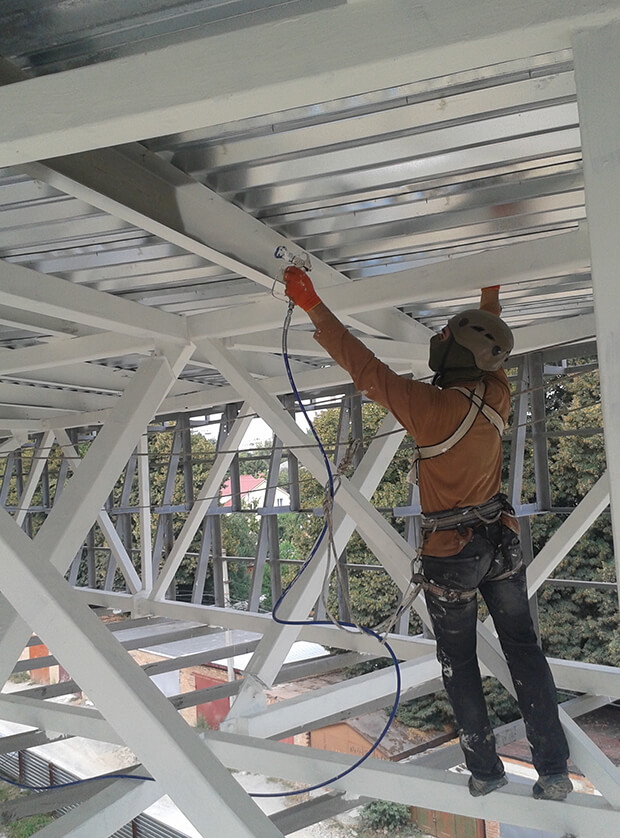

Эйфелева башня была построена в 1889 году. Интересно, что она должна была простоять не более двух десятков лет. Однако, эта легендарная башня до сих пор украшает Париж. А чтобы успешно противостоять времени ей помогает своевременная покраска металлоконструкций. Она производится каждые семь лет. Защита от воздействия окружающей среды – именно то, что позволит любой металлической конструкции служить десятилетиями. Кроме того, благодаря окраске, они почти не требуют ремонта. А качественно проведенная **[антикоррозийная защита](/zashhita-metallov-ot-korrozii/)** надолго сэкономит денежный и временный ресурсы.

## Этапы покраски металлоконструкции:

- **[Гидроструйная очистка](/preimushhestva-gidrostrujnoj-ochistki-metallokonstrukcij/)** давлением от 150 до 350 бар. С помощью аппарата снимается слой старых окрасочных материалов без образования пыли.
- Очистка поверхности. В любом случае, на ней присутствуют пыль и принесенные ветром песчинки. А то и более крупный сор. Но если состоянию конструкции длительное время не уделяли достаточного внимания — местами могут возникать и участки коррозии. Их тоже нужно соответствующим образом зачистить и обработать.
- Подготовка поверхности. **[Окраска металла](/pokraska-kryishi/)** производится в соответствии со всеми нормами и правилами. Прежде всего, должна быть нанесена соответствующая основа. Это необходимо для того, чтобы слой эмали держался много лет. Такая покраска металлоконструкций будет наиболее эффективной. Она позволит надолго забыть о необходимости ремонта.
- Нанесение краски. Как и предыдущие, этот этап подразумевает использование специального оборудования и лакокрасочных материалов. Благодаря этому можно выполнить работу быстро и с гарантией качества.

## Покраска металлических емкостей в Украине

Альпинистам из «**[Снежного барса](/)**» не нужны громоздкая подъемная техника, строительные леса и люльки. Благодаря этому снижается стоимость работ и их длительность. Кроме того, такой способ позволяет производить работы в труднодоступных местах и быстро красить сложные поверхности. Для нас очень важно качество работы. Поэтому мы подбираем только самые лучшие методы. Мы работаем в три смены и нередко выполняем заказы в нерабочее время. Например, вечером и ночью. Днем ваше предприятие сможет функционировать в обычном режиме. Обратившись к нам, вы получите идеально выполненный заказ без единого дня простоя!

## Стоимость покраски металлоконструкций формируется, исходя из:

- объема работ;
- формы и сложности конструкции. Работать с ровной плоскостью намного проще, чем с решетчатыми металлическими фасадами;
- высоты, на которой располагается объект;
- сложности доступа к конструкции и ее отдельным элементам;
- состояния поверхности. Когда и как в последний раз производилась окраска металлоконструкций?

**[Цена](/prajs/)** учитывает длительность и трудоемкость работ по очистке и подготовке металла к нанесению эмали.

Покраска металлоконструкций доступна в Киеве или любом другом городе Украины. Она производится с гарантией качества и в кратчайшие сроки. Позвоните уже сейчас! Вы найдете у нас самые выгодные цены и великолепные условия!
