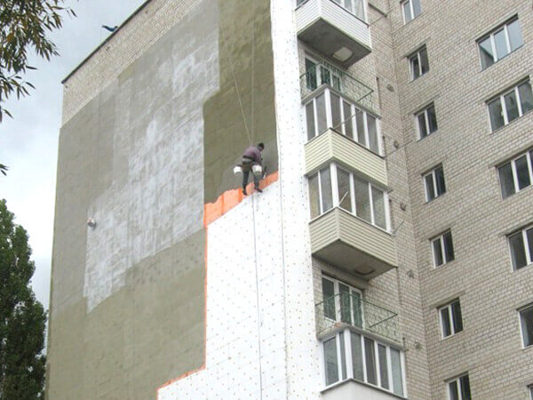
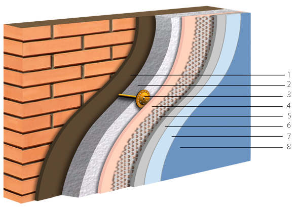
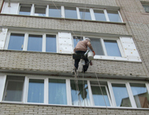
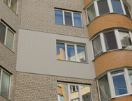
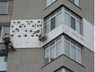

**_«Снежный Барс»_** – это команда специалистов в области промышленного альпинизма, которые могут обеспечить тепло и уют в Вашем доме. Для этой цели мы используем самую современную технологию [утепления стен домов](/naruzhnoe-uteplenie-sten-kvartir-domov/).

_

## Зачем это нужно?

Самый быстрый и доступный способ сохранить тепло и благоприятный климат в доме в любое время года – утепление стен (фасадов). Это особенно актуально для жителей старых и панельных домов.

Утеплителем является пенопласт – лучший натуральный теплоизолятор. Он состоит из воздуха на 98%, экологически чист, безопасен и имеет неограниченный срок эксплуатации. Утеплив плитами пенопласта наружные стены, можно защититься от жары и холода, предотвратить появление сырости, плесени и грибка в доме, значительно снизить затраты на отопление и кондиционирование жилья, улучшить звукоизоляцию помещений и продлить срок службы фасада. Но главное – утепление стен позволяет сократить теплопотери в жилище на 60%. Эта процедура даёт массу бытовых преимуществ, которые можно привести в качестве примеров.

## Что это даст?

_Абсолютное отсутствие сырости._

Распространённая проблема – отсырение угловых стен в квартирах. Если её не решать, возникает вероятность возникновения опасного для здоровья домочадчев грибка и плесени. Главная причина этого – промерзание тонких стен, а следовательно, недостаточная теплоизоляция. В доме с утеплёнными стенами нет места сырости, плесени и грибку!

_Полная теплоизоляция._

Чтобы жители дома не замерзали от холода и не изнывали от жары, утепление стен делают снаружи помещения. Лишь в этом случае точка промерзания сдвигается на внешнюю сторону стен, а теплоизолятор не позволяет им отдавать тепло изнутри помещения и проникать холодному или горячему воздуху вовнутрь.

_Большая экономия энергоресурсов._

Утепление даёт возможность экономить энергоресурс систем автономного отопления на 50% и увеличивает ресурс котла в 2 раза

## Методы и технологии утепления

**_«Снежный Барс»_** утепляет фасады, применяя в работе большой альпинистский опыт и самую технологичную, проверенную временем схему – приклеивание плит пенопласта _«методом перевязки швов» (в шахматном порядке)_. Только такой способ обеспечивает высокую прочность конструкции утепления, и максимально предотвращает образование сплошных вертикальных щелей и трещин.

Для утепления наружных стен наши специалисты применяют самые высококачественные материалы, в т.ч. производства компании «Ceresit» (Германия).

## Фасадная схема утепления

1.  Клеевой раствор
2.  Пенополистерол
3.  Тарельчатый дюбель
4.  Клеевой раствор Ceresit ct 85
5.  Армирующая сетка
6.  Клеевой раствор Ceresit ct 85
7.  1й слой покраски
8.  2й слой покраски

На все выполненные работы по утеплению **_«Снежный Барс»_** предоставляет трёхлетнюю гарантию. Мы поддерживаем постоянную связь с клиентами. Ведь нет лучшей награды для Мастера, чем уверенность в том, что каждый человек остаётся доволен его работой!
